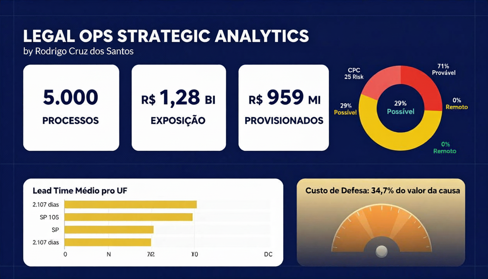

# Legal Ops Strategic Analytics: Jurimetria e Gestão de Risco


> "Em dados jurídicos, o custo de defesa muitas vezes rivaliza com o valor da causa — e quase ninguém está medindo isso."

## Sobre o Projeto

Sistema de **Legal Operations Analytics** que transforma dados brutos de tribunais brasileiros em insights financeiros e operacionais para tomada de decisão. O projeto simula a operação de um escritório de advocacia ou departamento jurídico corporativo com 5.000 processos ativos.

**4 pilares da análise:**

- **Inteligência Financeira** — Provisões contábeis (CPC 25), exposição financeira e custo de defesa
- **Eficiência Operacional** — Lead time processual, gargalos por UF e tipo de ação
- **Gestão de Risco** — Matriz de risco: probabilidade de perda × custo de defesa × valor da causa
- **Decisão Baseada em Dados** — Dashboards interativos com KPIs críticos para Legal Ops

## Dashboard Executivo



## Notebooks

| # | Notebook | Descrição | Status |
|---|----------|-----------|--------|
| 01 | `01_eda_legal_ops.ipynb` | Análise exploratória: perfil da carteira, distribuição de risco CPC 25, exposição financeira por classe | ✅ |
| 02 | `02_analise_jurimetria_estrategica.ipynb` | Matriz de risco por UF, custo de defesa vs valor da causa, lead time, ranking de eficiência | ✅ |

## Principais Achados

| Achado | Valor |
|--------|-------|
| Processos na carteira | **5.000** |
| Exposição financeira total | **R$ 1,28 bilhão** |
| Total provisionado (CPC 25) | **R$ 959 milhões** |
| Risco Provável | **71%** (3.547 processos) |
| Risco Possível | **29%** (1.453 processos) |
| Risco Remoto | **0%** — nenhum processo é tranquilo |
| Lead time médio | **2.107 dias** (~5,8 anos) |
| Lead time mediano | **1.474 dias** (~4 anos) |
| Custo de defesa médio | **R$ 89.099** por processo |
| Custo de defesa total | **R$ 445 milhões** |
| Custo/Valor da causa | **34,7%** — a cada R$ 100 em risco, R$ 34 vão para honorários e custas |
| Concentração em SP | **99,6%** dos processos (4.978 de 5.000) |
| Eficiência SP vs RS | SP **70,2** vs RS **83,2** — mais volume não significa mais eficiência |
| Tipo de ação principal | **Cível - Execução** (52,6%) |

## Metodologia

**Pipeline de dados:**

```
Kaggle (JSON bruto) → enrich_legal_data.py → legal_ops_dataset.csv → notebooks
```

**Decisões técnicas:**

| Decisão | Escolha | Motivo |
|---------|---------|--------|
| Classificação de risco | CPC 25 (Provável/Possível/Remoto) | Norma contábil brasileira para provisões |
| Provisão | Valor × probabilidade de perda | CPC 25: Provável = provisiona integral, Possível = 50%, Remoto = 0% |
| Simulação de custos | Baseada em lead time × taxa diária | Reflete honorários + custas acumulados ao longo do processo |
| Score de eficiência | Composto (custo + tempo + risco) / 3 | Normalização min-max, escala 0-100 |
| Visualização | Plotly (interativo) | Permite drill-down por UF, tipo de ação e classe de risco |

## Estrutura do Projeto

```
gestao-de-risco/
├── data/
│   └── legal_ops_dataset.csv          # Dataset enriquecido (5.000 processos × 12 colunas)
├── notebooks/
│   ├── 01_eda_legal_ops.ipynb          # Análise exploratória
│   └── 02_analise_jurimetria_estrategica.ipynb  # KPIs e dashboards
├── scripts/
│   └── enrich_legal_data.py            # Pipeline de enriquecimento (JSON → CSV)
├── extrair_metricas.py                 # Extração rápida de métricas via console
├── dashboard_jurimetria.png            # Dashboard executivo do projeto
├── requirements.txt
└── README.md
```

## Como Executar

```shell
git clone https://github.com/RodrigoPresida/gestao-de-risco.git
cd gestao-de-risco
pip install -r requirements.txt
jupyter notebook notebooks/
```

O dataset já está incluído em `data/` (584 KB). O script de enriquecimento (`scripts/enrich_legal_data.py`) espera o JSON bruto do Kaggle — [Brazilian Legal Proceedings](https://www.kaggle.com/datasets/eduardowoj/bzln Brazilian-legal-proceedings).

## Stack

| Tecnologia | Uso |
|------------|-----|
| **Python 3.12** | Linguagem base |
| **Pandas** | Manipulação e análise de dados tabulares |
| **NumPy** | Operações numéricas e simulações |
| **Plotly** | Gráficos interativos (pie, bar, box, gauge) |
| **Jupyter Notebook** | Ambiente de análise e documentação |

## Autor

**Rodrigo Cruz dos Santos** — Analista de Dados e Desenvolvedor Python

[](https://www.linkedin.com/in/rodrigocruzsantos/)
[](https://github.com/RodrigoPresida)
